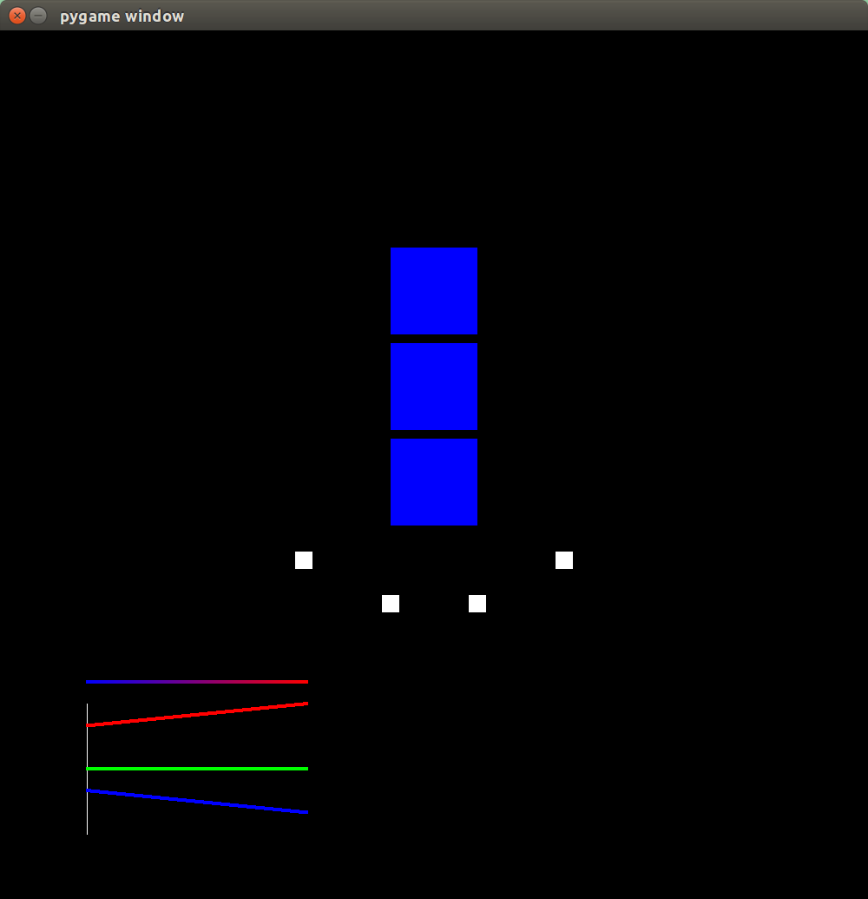

# blue-hour-sim

Blue Hour is a responsive installation that changes due to activity around it, commissioned for Light City Baltimore 2016. High activity produces gradients of blue to red light. Low activity reveals a ‘shy robot’ personality which blinks in morse code about its interaction history. These states can be activated by the motion of walking around the installation, or by patiently sitting still.

The work is named after the blue hour of the morning and evening, when the sun is below the horizon, the indirect light is blue, and first/last reds and yellows of the sun are visible. This installation explores ideas of transitions in motion, time, and place. How does the personality of a place change with activity, and how does that change how one feels about it? How does this inform the use of the place?

Technical Summary
The large white cubes of Blue Hour are IBC totes (intermediate bulk containers). IBC totes are widely used as an industry standard for shipping liquids of all kinds. We employ a wireless DMX lighting assembly to activate the totes as lighting elements. These DMX lights are driven by an Arduino Teensy on a custom PCB (the Rocket), reading four PIR motion sensors pointed at the surrounding environment.

Simulator for our Blue Hour installation at Light City Baltimore in March 2016

